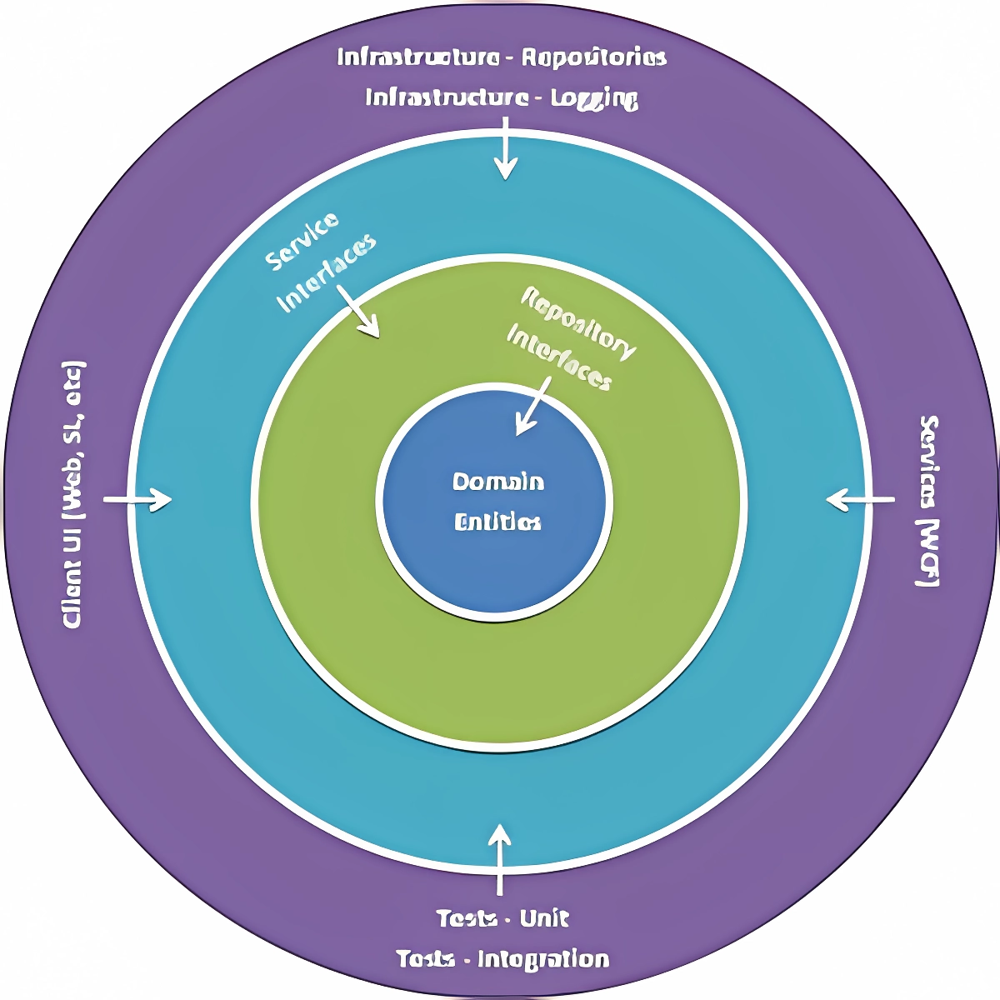

<!DOCTYPE html>
<html lang="tr">
<head>
<meta charset="UTF-8">
</head>

<body>
<!-- Proje Başlığı -->

<h1 style="font-size:3rem;">
Soğan Mimarisi ile Yapılandırılmış Proje Taslağı
</h1>

<!-- Proje Açıklaması -->

<h2 style="font-size:2.25rem; text-align:center;">
Proje Açıklaması
</h2>

.NET 9.0 teknolojisi ile geliştirilmiş, sıfırdan proje geliştirme işlemlerinin önüne geçmek için 
toplamda beş katmandan tasarlanmış, olabildiğince basitleştirilmiş bir proje taslağıdır.

<!-- Proje Durumu -->

<h2 style="font-size:2.25rem; text-align:center;">
Proje Durumu
</h2>

Proje taslağı geliştirme aşamasındadır.

<!-- Kurulum Talimatları -->

<h2 style="font-size:2.25rem; text-align:center;">
Kurulum Talimatları
</h2>

GitHub 'dan projeyi kurmak için aşağıdaki adımları izleyin:

<ol style="font-size:1.75rem; margin:0px; padding:0px;">
<li>Terminal veya Komut İstemcisi'ni açın.</li>
<li>Aşağıdaki komutu kullanarak projeyi klonlayın:
<pre><code>git clone https://github.com/headclef/Onion-Structured-MVC-Template.git</code></pre>
</li>
<li>Proje dizinine gidin:
<pre><code>cd Onion-Structured-MVC-Template</code></pre>
</li>
<li>Gerekli bağımlılıkları yüklemek için aşağıdaki komutu çalıştırın:
<pre><code>dotnet restore</code></pre>
</li>
<li>Projeyi çalıştırmak için:
<pre><code>dotnet run</code></pre>
</li>
</ol>

<!-- Kullanım Kılavuzu -->

<h2 style="font-size:2.25rem; text-align:center;">
Kullanım Kılavuzu
</h2>

Geliştirecek olduğunuz projenin ön yüzünü ve arka yüzünü tanımlayabileceğiniz yapıyı elde etmiş olursunuz.
Bu yapıyı kullanarak projenizi geliştirebilir ve yönetebilirsiniz. Dilerseniz proje yapısını değiştirebilir
ve kendi projenize uygun hale getirebilirsiniz.

<!-- Özellikler -->

<h2 style="font-size:2.25rem; text-align:center;">
Özellikler
</h2>

Proje taslağı, aşağıdaki özelliklere sahiptir:

<ul style="font-size:1.75rem; margin:0px; padding:0px;">
<li>Soğan Mimarisi</li>
<li>Entity Framework Core</li>
<li>Bağımlılık Enjeksiyonu</li>
<li>Repository Pattern</li>
<li>Unit of Work Pattern</li>
<li>AutoMapper</li>
<li>Logging</li>
<li>Global Exception Handling</li>
<li>Global Response Wrapper</li>
</ul>

<!-- Katmanlar -->

<h2 style="font-size:2.25rem; text-align:center;">
Katmanlar
</h2>

Proje soğan mimarisini temel almıştır. Bu yüzden katmanları aşağıdaki gibi olup, asla içeriden dışarıya
doğru bağımlılık olmamalıdır.

<ul style="font-size:1.75rem; margin:0px; padding:0px;">
<li>Core</li>
<ul>
<li>

Domain:
 
Bu katman, projenin temel yapı taşlarını içerir ve projenin diğer katmanlarına 
bağımlı olmamalıdır.
<pre><code>public class BaseEntity
{
	[Key]
	public int Id { get; set; }
	public DateTime CreatedAt { get; set; }
	public DateTime UpdatedAt { get; set; }
}
</code></pre>

</li>
<li>

Application:
 
Bu katman, projenin iş mantığını içerecek elemanların imzalarını taşır ve projenin 
diğer katmanlarına bağımlı olmamalıdır.
<pre><code>public interface IBaseRepository&lt;T&gt; where T : BaseEntity
{
	Task&lt;ModelResponse&lt;T&gt;&gt; AddAsync(T entity);
	Task&lt;ModelResponse&lt;T&gt;&gt; UpdateAsync(T entity);
	Task&lt;ModelResponse&lt;T&gt;&gt; DeleteAsync(int id);
	Task&lt;ModelResponse&lt;T&gt;&gt; GetByIdAsync(int id);
	Task&lt;IEnumerable&lt;T&gt;&gt; GetAllAsync();
}
</code></pre>

</li>
</ul>
<li>Infrastructure
</li>
<ul>
<li>

Infrastructure
 
Bu katman, projenin dış dünyayla iletişimini sağlayacak elemanları içerir ve projenin
alt katmanlarına bağımlı olabilir ancak üst katmanlara bağımlı olmamalıdır.
<pre><code>public interface IBaseService
{
	Task&lt;ModelResponse&lt;T&gt;&gt; AddAsync(T entity);
	Task&lt;ModelResponse&lt;T&gt;&gt; UpdateAsync(T entity);
	Task&lt;ModelResponse&lt;T&gt;&gt; DeleteAsync(int id);
	Task&lt;ModelResponse&lt;T&gt;&gt; GetByIdAsync(int id);
	Task&lt;IEnumerable&lt;T&gt;&gt; GetAllAsync();
}
</code></pre>
<pre><code>public class BaseService : IBaseService
{
	private readonly IUnitOfWork _unitOfWork;
	private readonly IMapper _mapper;
	private readonly ILogService _logService;
	public BaseService(IUnitOfWork unitOfWork, IMapper mapper, ILogService logService)
	{
		_unitOfWork = unitOfWork;
		_mapper = mapper;
		_logService = logService;
	}
	// Diğer metotlar
}</code></pre>

</li>
<li>

Persistence
 
Bu katman, projenin veritabanı işlemlerini gerçekleştirecek elemanları içerir ve projenin
alt katmanlarına bağımlı olabilir ancak üst katmanlara bağımlı olmamalıdır.
<pre><code>public class BaseDbContext : DbContext
{
	// Entity 'lerin DbSet 'leri
	public BaseDbContext(DbContextOptions&lt;BaseDbContext&gt; options) : base(options) { }
}
</code></pre>
<pre><code>public class UnitOfWork : IUnitOfWork
{
	private readonly BaseDbContext _context;
	public UnitOfWork(BaseDbContext context)
	{
		_context = context;
	}
	// Diğer metotlar
}
</code></pre>
<pre><code>public class BaseRepository&lt;T&gt; : IBaseRepository&lt;T&gt; where T : BaseEntity
{
	private readonly BaseDbContext _context;
	private readonly IMapper _mapper;
	public BaseRepository(BaseDbContext context, IMapper mapper)
	{
		_context = context;
		_mapper = mapper;
	}
	// Diğer metotlar
}
</code></pre>
Bu katmanda elde edilen hatalar, Infrastructure katmanına gönderilerek yönetilir. Bu işlem için
ise;
<pre><code>try
{
	// İşlemler
}
catch (Exception exception)
{
	return new Exception(exception.Message);
}
</code></pre>
Yapısı kullanılır.

</li>
</ul>
<li>Presentation</li>
<ul>
<li>

MVC
 
Bu katman, projenin kullanıcı arayüzünü oluşturacak elemanları içerir ve projenin
alt katmanlarına bağımlı olabilir ancak üst katmanlara bağımlı olmamalıdır. İyi bir
izolasyon sağlanabilirse bu katmanın, projenin diğer katmanlarına bağımlı olmaması
gerekmektedir.

</li>
</ul>
</ul>

<!-- Katkıda Bulunanlar -->

<h2 style="font-size:2.25rem; text-align:center;">
Katkıda Bulunanlar
</h2>

Bu projeye katkıda bulunanlar:

<ul style="font-size:1.75rem; margin:0px; padding:0px;">
<li><a href="https://github.com/headclef">headclef</a></li>
</ul>

</body>

</html>
