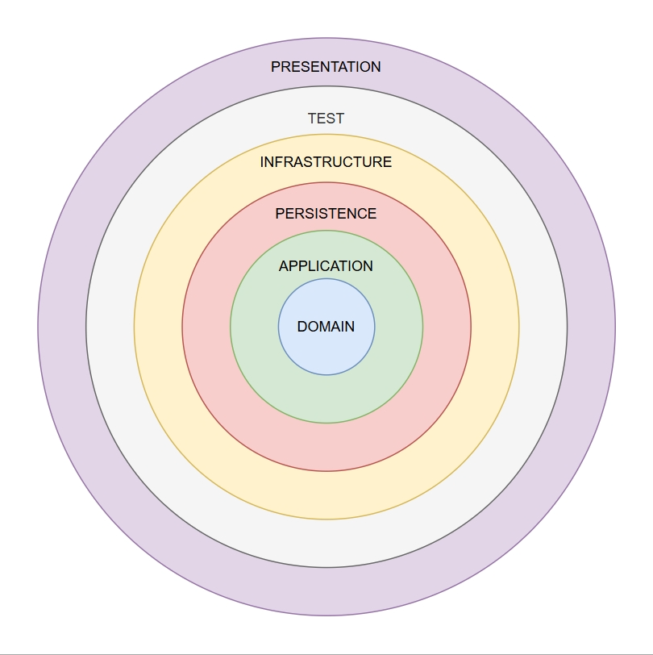

<!DOCTYPE html>
<html lang="tr">
<head>
  <meta charset="UTF-8">
  <title>Soğan Mimarisi Projesi</title>
</head>
<body style="margin: 0; padding: 0; font-family: 'Segoe UI', sans-serif; font-size: 1.5rem; line-height: 1.6; background-color: #fff; color: #222;">

  

    <h1 style="text-align:center; font-size:3rem;">Soğan Mimarisi ile Yapılandırılmış Proje Taslağı</h1>
  

  

    <h2 style="text-align:center; font-size:2.25rem;">Proje Açıklaması</h2>
    

      .NET 9.0 teknolojisi ile geliştirilmiş, sıfırdan proje geliştirme işlemlerinin önüne geçmek için toplamda beş katmandan tasarlanmış, olabildiğince basitleştirilmiş bir proje taslağıdır.
    

  

  

    <h2 style="text-align:center; font-size:2.25rem;">Proje Durumu</h2>
    

      Proje taslağı geliştirme aşamasındadır.
    

  

  

    <h2 style="text-align:center; font-size:2.25rem;">Kurulum Talimatları</h2>
    

      GitHub 'dan projeyi kurmak için aşağıdaki adımları izleyin:
    

    <ol style="font-size:1.75rem; padding-left: 40px;">
      <li>Terminal veya Komut İstemcisi'ni açın.</li>
      <li>Projeyi klonlayın: <pre><code>git clone https://github.com/headclef/Onion-Structured-MVC-Template.git</code></pre></li>
      <li>Proje dizinine gidin: <pre><code>cd Onion-Structured-MVC-Template</code></pre></li>
      <li>Bağımlılıkları yükleyin: <pre><code>dotnet restore</code></pre></li>
      <li>Projeyi çalıştırın: <pre><code>dotnet run</code></pre></li>
    </ol>
  

  

    <h2 style="text-align:center; font-size:2.25rem;">Kullanım Kılavuzu</h2>
    

      Geliştirecek olduğunuz projenin ön yüzünü ve arka yüzünü tanımlayabileceğiniz yapıyı elde etmiş olursunuz. Bu yapıyı kullanarak projenizi geliştirebilir ve yönetebilirsiniz. Dilerseniz proje yapısını değiştirebilir ve kendi projenize uygun hale getirebilirsiniz.
    

  

  

    <h2 style="font-size:2.25rem;">Proje Mimarisi</h2>
    

      Aşağıdaki diyagram, projenin katmanlı mimarisini (Onion Architecture) yansıtmaktadır. 
      İçten dışa doğru bağımlılık akışını ve katmanların hiyerarşisini göstermektedir.
    

    
  

  

    <h2 style="text-align:center; font-size:2.25rem;">Proje Katmanları</h2>
    <ul style="font-size:1.75rem; padding-left: 40px;">
      <li><strong>Core</strong>
        <ul>
          <li>Domain (Entity Layer)</li>
          <li>Application (Interface Layer)</li>
        </ul>
      </li>
      <li><strong>Infrastructure</strong>
        <ul>
          <li>Infrastructure (Service Layer)</li>
          <li>Persistence (Context Layer)</li>
        </ul>
      </li>
      <li><strong>Presentation</strong>
        <ul>
          <li>MVC UI (User Interface Layer)</li>
        </ul>
      </li>
      <li><strong>Test</strong>
        <ul>
          <li>Unit Tests</li>
          <li>Fake Data</li>
          <li>Test Helpers</li>
        </ul>
      </li>
    </ul>
  

  

    <h2 style="text-align:center; font-size:2.25rem;">Özellikler</h2>
    <ul style="font-size:1.75rem; padding-left: 40px;">
      <li>Katmanlı mimari (Onion Architecture)</li>
      <li>Entity Framework Core ile veri yönetimi</li>
      <li>Repository & Unit of Work pattern desteği</li>
      <li>AutoMapper ile model–entity dönüşümleri</li>
      <li>Merkezi loglama sistemi</li>
      <li>Exception Handling mekanizması</li>
      <li>Response Wrapper ile standart cevaplar</li>
      <li>SMTP destekli e-posta servisi</li>
      <li>Background mail queue (async işlem yapısı)</li>
      <li>Unit Test altyapısı (xUnit, Moq)</li>
    </ul>
  

  

    <h2 style="text-align:center; font-size:2.25rem;">Loglama</h2>
    

      Loglama işlemleri <code>Infrastructure</code> katmanında merkezi olarak gerçekleştirilir. Log türleri (Bilgi, Hata, Uyarı) için farklı dosyalar oluşturulur ve dosya boyutu ile tarihe göre yönetilir.
    

    

      Her loglama işleminde aşağıdaki adımlar sırasıyla uygulanır:
    

    <pre style="padding:10px; border-radius:6px; overflow-x:auto; font-size:1.5rem;">
private void PrepareLogEnvironment(string logType)
{
    EnsureLogPathExists();           // 1️⃣ Klasör oluşturulur
    EnsureLogFileExists(logType);    // 2️⃣ Dosya kontrolü yapılır
    RotateLogFile(logType);          // 3️⃣ Boyut/tarih kontrolü ile arşive taşınır
    ArchiveOldLogsToZip();           // 4️⃣ Arşiv klasörü ziplenir
}   </pre>
    

      Bu yapı sayesinde gereksiz log birikimi önlenir, okunabilirlik ve yönetilebilirlik sağlanır. İlerleyen sürümlerde veritabanı loglama ya da dış servis entegrasyonları da yapılabilir.
    

  

  

    <h2 style="text-align:center; font-size:2.25rem;">Katkıda Bulunanlar</h2>
    

      Bu projeye katkıda bulunanlar:
    

    <ul style="font-size:1.75rem; padding-left: 40px;">
      <li><a href="https://github.com/headclef">headclef</a></li>
    </ul>
  

</body>
</html>
